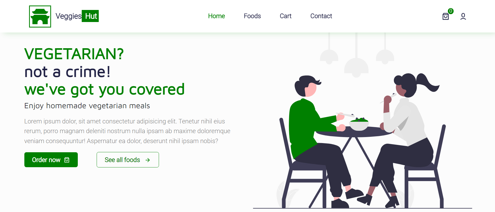

# VeggiesHut

## Preview Application

- https:// veggieshut.netlify.app

## Feautures Include

- Add to cart functionality
- Shopping cart functionality
- Product Filtering functionality
- Product page
- Cart and checkout page
- Contact page
- Login and Register page

# Steps to use Application

- Download Entire code
- Ensure Node js is installed on your system
- Open prject folder with Vscode or prefered code editor
- Run "npm install" -- to install all necessary dependencies
- run "npm start" -- to start application

Feel free to edit and use as you like,Free use of this software does NOT apply if you plan to produce your own course or tutorials based on this project. A credit to the original authors [Israel Akinwumi](https://twitter.com/akinwumidi) and [Xerax labs](https://twitter.com/xeraxlabs) will be appreciated.

## Help / Collaboration

Need help making this project work, want to collaborate on future project or hire me? you can reach out via

- [LinkedIn](https://www.linkedin.com/in/akinwumidi)
- [Twitter](https://twitter.com/akinwumidi)

# Technologies Used

- React Js
- Redux Toolkit
- SCSS [ Styling ]
- React icons [ Icons ]
- Swiper JS
- Reactstrap
- React Paginate

## Related

- [responsive-testimonial-slider](https://github.com/Xeraxlabs/responsive-testimonial-slider.git)

## Disclaimer

We do not claim to be the original authors of the images used in this project, all image credits belong to their respective owners. credits [undraw](https://undraw.co/)

## License

VeggiesHut is licensed under the [MIT license](http://opensource.org/licenses/MIT).
